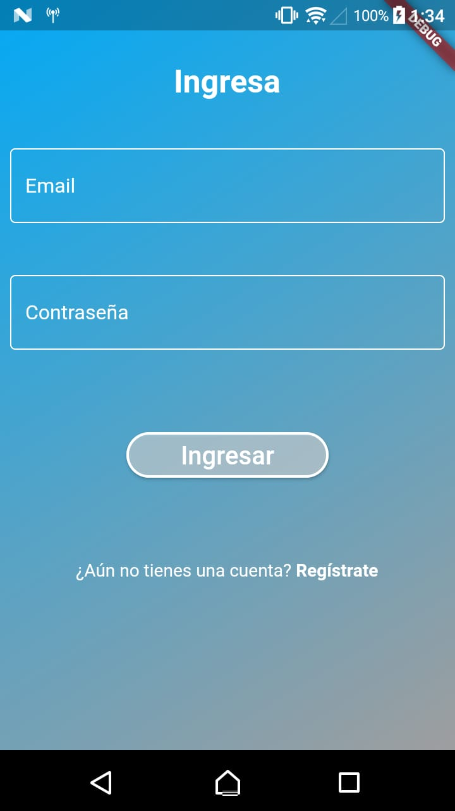
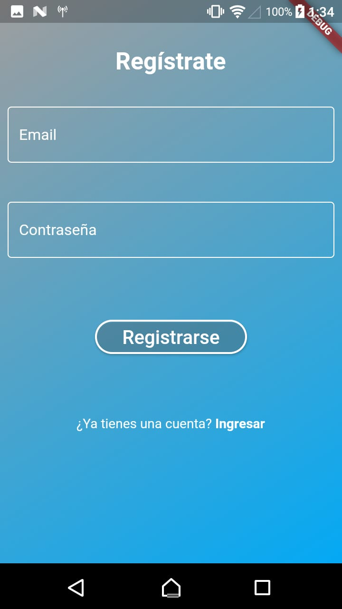
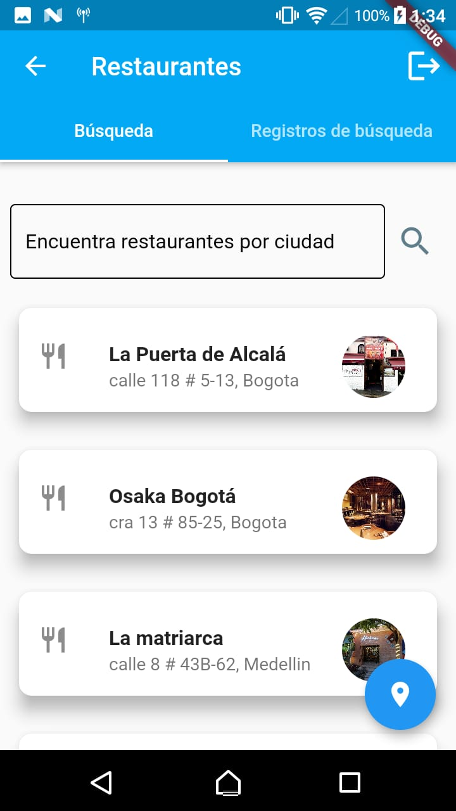
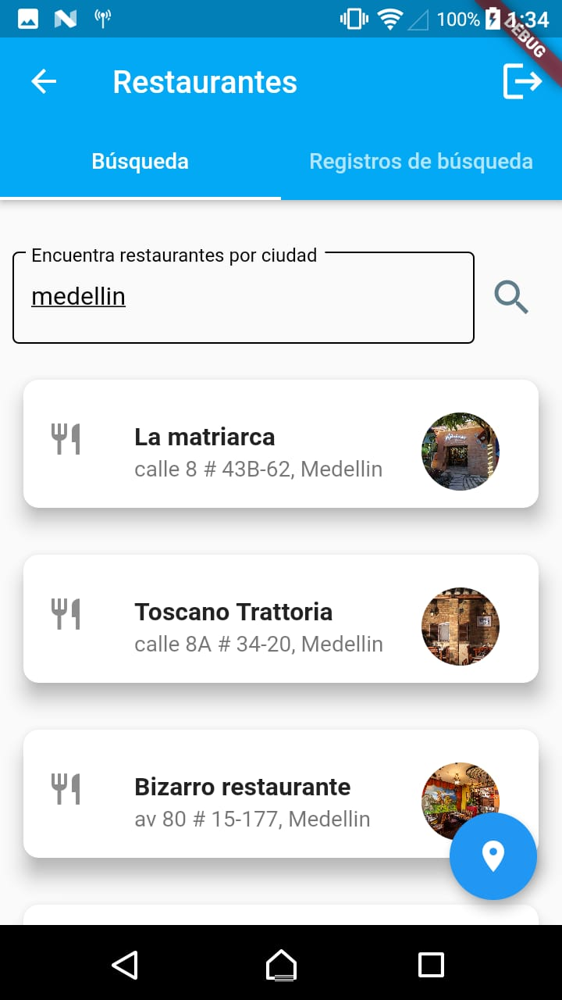
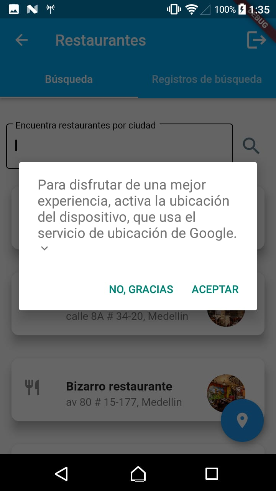
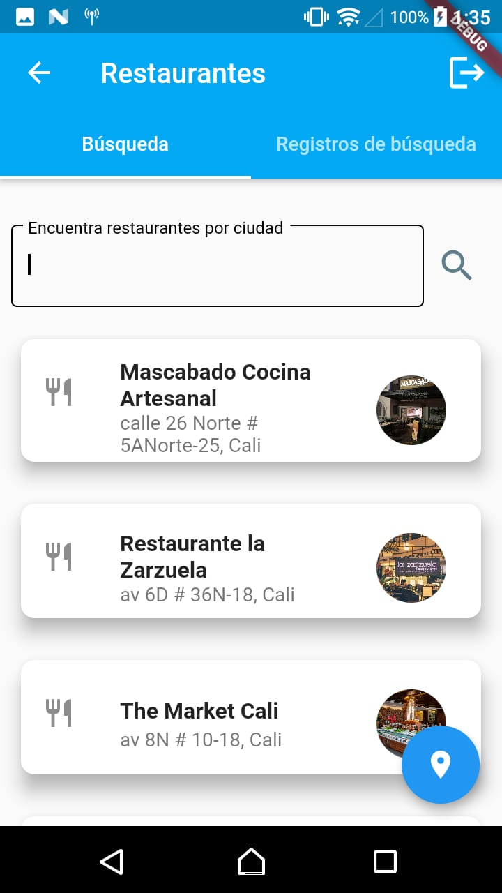
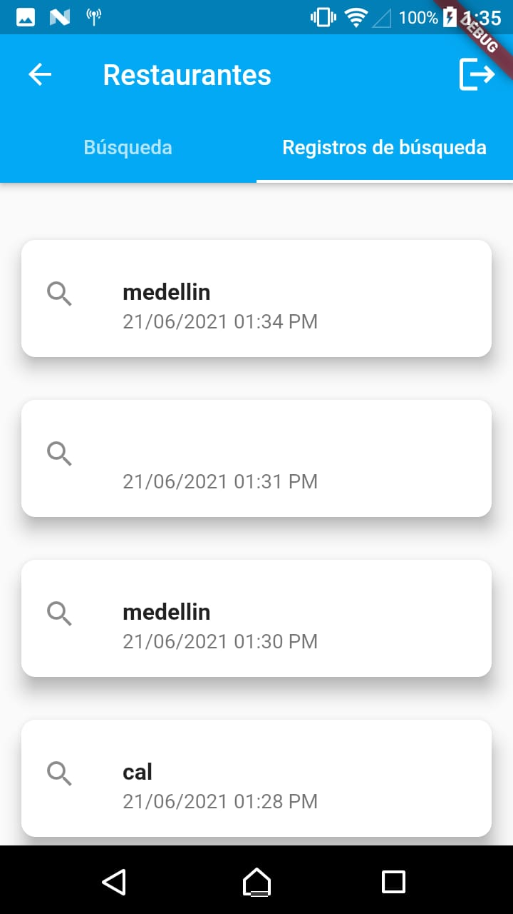
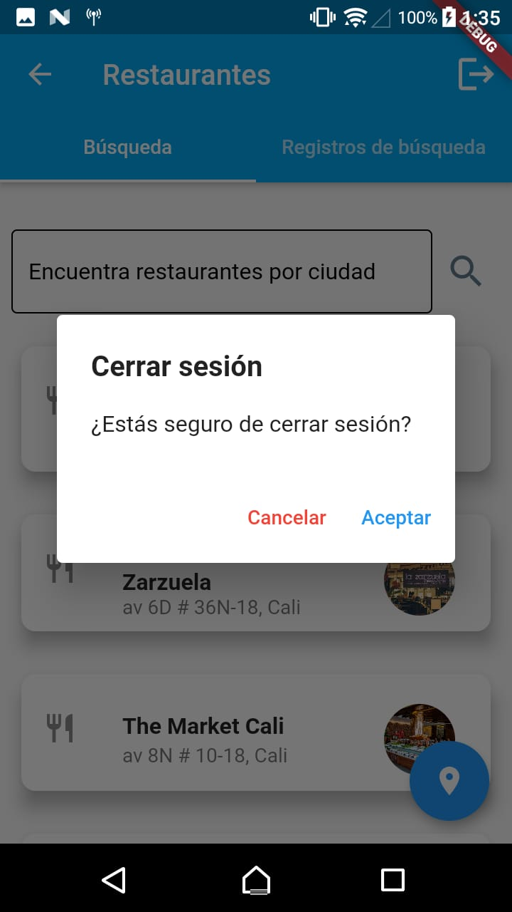

# tyba_test
Prueba técnica front-end Tyba.

## Descripción
Proyecto desarrollado con Flutter con las siguientes funcionalidades:
1. Registro de usuario.
2. Login de usuario.
3. Búsqueda de restaurantes al escribir la ciudad en un input. 
4. Búsqueda de restaurantes por medio de la ubicación del dispositivo.
5. Registro de las búsquedas hechas por el usuario.
6. Logout de usuario.

## Screenshots
<div style="display:flex;flex-direction:row;justify-content: space-between">
    
    
    
    
</div>

<div style="display:flex;flex-direction:row;justify-content: space-between">
    
    
    
    
</div>


## Introducción e instalación
Estas instrucciones le proporcionarán una copia del proyecto en funcionamiento en su máquina local con fines de prueba.

* Primero, abre tu terminal y clona el repositorio en tu computador:
```
git clone https://github.com/jaimeduque17/tyba_test.git
```
* ingresa a la carpeta en donde clonaste el proyecto, e instala todas las dependencias:
```
$ cd tyba_test
$ flutter pub get
```
* Conecta un dispositivo Android a tu computador o abre un emulador virtual Android. Desde la terminal ejecuta:
``` 
$ flutter run
```
* Esto debería abrir la aplicación.

## Nota
* Se ha creado un usuario para facilidad de quien pruebe este proyecto. Las credenciales son las siguientes:
usuario: usuario@tyba.com
contraseña: 123456789

* Debido a que no encontré API pública de restaurantes, decidí crear una base de datos en Firebase con 50 registros, en dicha base de datos, registré restaurantes en ciudades como Bogota, Medellin, Barranquilla y Cali.


## Autor
* **Jaime Duque** - (https://github.com/jaimeduque17)
